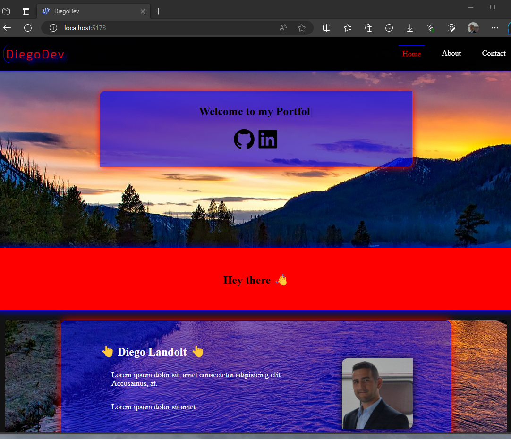
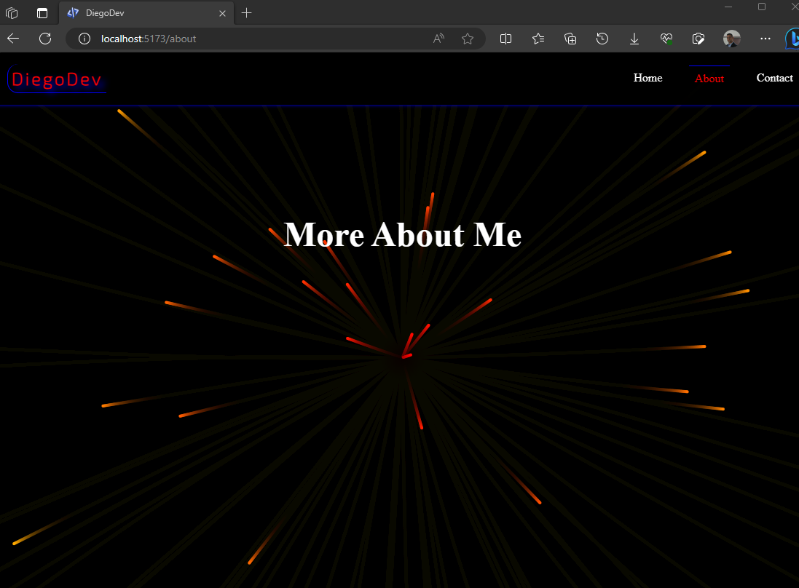

# Diego Landolt Monfort Portfolio

Este es el portafolio de Diego Landolt Monfort, un apasionado desarrollador frontend de España. 
Este proyecto está construido con React y Vite.

## Descripción
Este portafolio muestra los proyectos y habilidades

🚀 Instalación y ejecución
Sigue estos pasos para clonar y ejecutar el proyecto en tu máquina local:

bash
Copiar
Editar
### Clona el repositorio
git clone https://github.com/diego-monfort-landolt/Landoltdiego.git

### Entra en el directorio del proyecto
cd Landoltdiego

### Instala las dependencias
npm install

### Ejecuta el proyecto en modo desarrollo
npm run dev
Una vez hecho esto, abre tu navegador y ve a http://localhost:5173 para ver el portafolio en funcionamiento.

## Tecnologías Utilizadas
-- React
-- Vite
-- TypeScript
-- JavaScript
-- HTML
-- CSS

Contribuciones
Las contribuciones son bienvenidas. Si encuentras algún error o tienes sugerencias de mejora, por favor abre un issue en el repositorio o envía un pull request. Asegúrate de seguir las pautas de contribución y de proporcionar una descripción clara de los cambios que propones.

